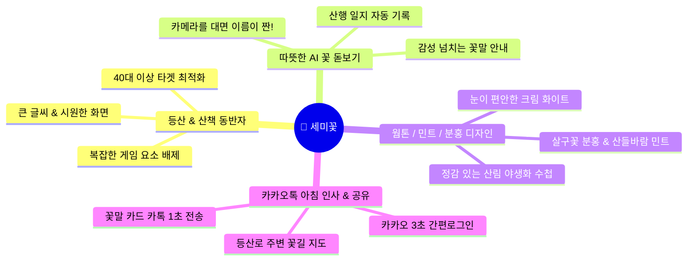
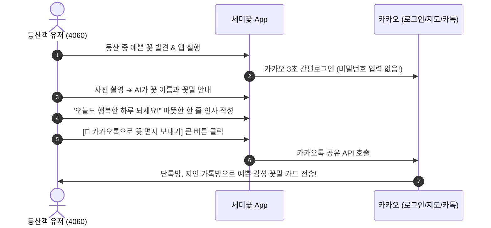

# 🌸 세미꽃 (이 세상에 미운 꽃은 없다) - 모바일 앱 서비스 기획서

> **"등산길, 산책길에 만난 이름 모를 꽃에게 따뜻한 이름을 불러주세요."**  
> **세미꽃**은 한국의 산과 들을 걷는 **40대 이상 등산/산책 마니아**를 위한 **직관적이고 따뜻한 AI 야생화 수첩 & 카카오톡 감성 소통 플랫폼**입니다.

---

## 1. 서비스 개요 & 핵심 가치 (4060 타겟 맞춤형)

| 구분 | 상세 내용 |
| :--- | :--- |
| **서비스명** | **세미꽃** (이 세상에 미운 꽃은 없다) |
| **핵심 컨셉** | **"4060 등산객을 위한 정감 있는 AI 야생화 수첩 & 카카오톡 감성 편지"** |
| **주요 타겟층** | • 주말마다 등산, 트레킹, 숲길 산책을 즐기는 **40대~60대 액티브 시니어 및 중장년층** • 예쁜 꽃 사진을 찍고 **카카오톡으로 아침 인사나 감성 글귀를 나누기** 좋아하는 유저 • 복잡한 게임(포켓몬 고 등)보다, **내 산행 발자취와 식물 지식**을 소박하게 모으고 싶은 유저 |
| **디자인 톤앤매너** | 🚫 어두운 다크모드 / 복잡한 SF 게임 레이더 배제 ⭕ **따뜻한 웜톤(Cream White) 배경 + 살구꽃 분홍(Peach Pink) + 산들바람 민트(Sage Mint) 포인트**로 눈이 편안하고 화사한 감성 |

---

## 2. 핵심 기능 정의 (40대 이상 타겟 친화적 UX)

### ① 따뜻한 AI 꽃 돋보기 & 산행 꽃 수첩
* **복잡한 조작 없는 '원터치 돋보기 스캔'**:
  * 스마트폰 카메라를 꽃에 향하고 동그란 셔터만 누르면, 복잡한 레이저 효과 대신 **부드러운 돋보기 애니메이션**과 함께 1초 만에 꽃 이름이 표시됩니다.
* **눈이 편안한 큰 글씨와 정감 있는 정보**:
  * **꽃 이름과 꽃말**: 큰 한글 글씨로 시원하게 표시 (예: **진달래** - *💌 "사랑의 기쁨, 절제된 아름다움"*)
  * **산행 일지 자동 박제**: "언제, 어느 산에서 만났는지" (예: *2026년 7월 2일, 북한산 둘레길에서 만남*) 자동 기록.
* **게임 용어 대신 정감 있는 '우리 꽃 분류'**:
  * 🚫 게임식 희귀도(Rare, Epic, Legendary) 용어 완화
  * ⭕ **"길가에 친근한 꽃"**, **"계절이 선물한 꽃"**, **"깊은 산속 귀한 보물 (특산식물)"** 등 직관적이고 아름다운 한국어 표현 사용.

---

### ② 카카오톡 감성 소통 & 아침 인사 최적화 (가장 강력한 무기!)
40대 이상 유저층이 하루에 가장 많이 사용하는 앱인 **카카오톡**과의 연결성을 극대화했습니다.

* **🔑 카카오 원클릭 로그인**: 복잡한 비밀번호 찾기나 회원가입 절차 없이, 황금색 카카오 버튼 한 번이면 끝납니다.
* **💬 카카오톡 아침 인사 템플릿**:
  * 중장년층 유저들이 매일 아침 카톡으로 나누는 **"좋은 아침 인사 + 꽃 사진"** 문화를 서비스의 핵심 바이럴 포인트로 잡았습니다.
  * 템플릿 버튼 하나로 **[내가 산에서 찍은 꽃 사진 + 꽃말 + 오늘의 감성 인사글]**이 고급스러운 엽서 카드로 변환되어 카톡방에 전송됩니다.

---

### ③ 등산로 산책 지도 (카카오맵 밝은 모드 연동)
* **어두운 SF 레이더 지도는 NO! 화사하고 밝은 산책길 지도**:
  * 눈이 편안한 화이트/그린 톤의 카카오맵 위에 등산로와 둘레길을 따라 발견된 예쁜 꽃들의 위치가 **나뭇잎/꽃잎 마스킹 핀마커**로 부드럽게 표시됩니다.
* **주말 산행 추천**:
  * *"이번 주말 청계산 둘레길에 '노랑매미꽃'이 활짝 피고 있어요!"*와 같이 산행 코스를 추천해 주는 가이드 역할을 합니다.

---

## 3. 리텐션(재방문) 및 동기 부여 (게임 요소 제외 ➔ 성취감 고취)

포켓몬 고 식의 경쟁이나 전투, 복잡한 퀘스트 대신 **"기록의 뿌듯함과 자연 속 성취감"**을 줍니다.

1. **🌿 나의 계절 꽃 수첩 (계절별 앨범)**:
   * "봄날의 발자취", "여름 산길의 기억", "가을 단풍과 야생화" 등 계절별로 내가 찍은 꽃들이 앨범책처럼 정리되어 차곡차곡 쌓이는 재미를 줍니다.
2. **🏅 산행 발자취 스탬프**:
   * "이번 달 산행에서 5가지 꽃과 인사했어요", "우리 동네 둘레길 단골 탐험가" 등 소박하고 기분 좋은 도장(스탬프)을 쾅 찍어드립니다.

---

## 4. 기술 및 데이터 구현 가능성 요약

* **공공 데이터 (100% 무료)**: 농촌진흥청 '오늘의 꽃말' API + 산림청 국립수목원 NATURE 야생화 DB 연동.
* **AI 식별**: PlantNet Cloud API (MVP) ➔ AI Hub 자생식물 데이터 기반 파인튜닝 (2단계) ➔ 온디바이스 AI (3단계).
* **서버리스 인프라**: **Supabase (PostgreSQL + PostGIS)**로 위치 기반 꽃 검색 및 카카오 로그인 통합.
