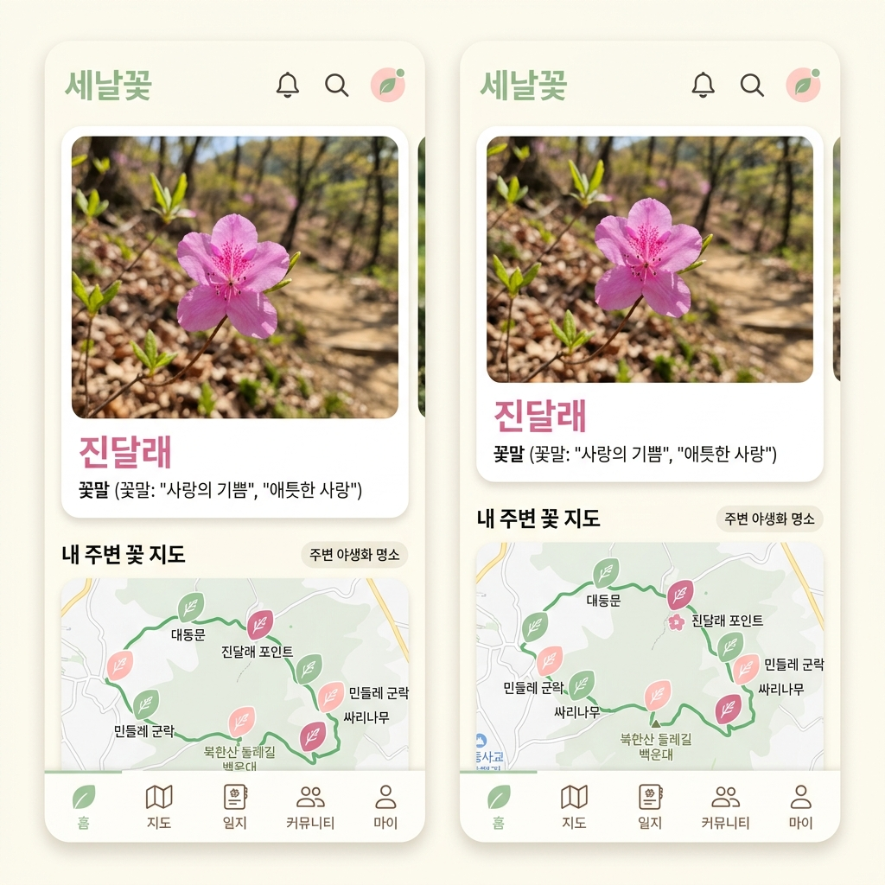

# 📱 세미꽃 (이 세상에 미운 꽃은 없다) - UX 스토리보드 & 화면 설계서 (4060 등산객 맞춤형)

> **"눈이 편안한 시원한 큰 글씨, 따뜻한 웜톤과 민트/분홍의 감성, 1초 만에 보내는 카톡 아침 인사"**  
> 본 설계서는 등산과 산책을 사랑하는 **40대 이상 중장년층 유저**를 위해, 복잡한 게임 요소를 빼고 **직관적이고 정감 있는 UX**로 전면 개편한 화면 스토리보드입니다.



---

## 1. 4060 맞춤형 UX 원칙 (3大 Core Principles)


---

## 2. 5대 핵심 화면 스토리보드 (Screen Specifications)

### 🏔️ Screen 1. 메인 홈: 화사한 산책 지도 & 카카오 3초 간편로그인

```
+-------------------------------------------------------+
|  [🌸 세미꽃]                   [🔍 산/꽃 검색]  [🔔 알림] |
|-------------------------------------------------------|
|  (배경: 눈이 편안한 크림 화이트 + 산들바람 민트 톤)          |
|                                                       |
|  [ 🌸 오늘의 꽃 ]   [ 🌿 주변 산책로 ]   [ ⭐ 귀한 꽃 ]      |
|                                                       |
|       ( 🗺️ 밝고 화사한 카카오맵 둘레길 산책 지도 )        |
|                                                       |
|        [📍 내 위치: 북한산 둘레길 입구 산책로]            |
|                                                       |
|            🌿(나뭇잎 핀: 진달래 꽃길 - 50m 앞)            |
|                                                       |
|                     🌸(분홍 핀: 노랑매미꽃 - 100m)       |
|                                                       |
|  +-------------------------------------------------+  |
|  | 💡 오늘의 산행 팁: "북한산 계곡길에 야생화가 한창이에요!" |  |
|  +-------------------------------------------------+  |
|                                                       |
|-------------------------------------------------------|
|  [ 🏠 산책지도 ]     [ 🔘 (꽃 돋보기) ]     [ 📚 나의수첩 ] |
+-------------------------------------------------------+
```

#### 📌 4060 타겟 핵심 UX 명세
1. **황금색 카카오 원클릭 시작**: "비밀번호 입력 없이 안전하고 간편하게 카카오로 시작하세요" 큰 안내 문구 배치.
2. **시원시원한 밝은 지도 (Light Mode Map)**: 어두운 SF 레이더를 없애고, 산뜻한 민트/화이트 톤의 카카오맵 위에 나뭇잎과 꽃잎 모양의 예쁜 핀마커가 피어납니다.
3. **큼직한 하단 바 & 꽃 돋보기 버튼**: 노안이 있어도 안경 없이 편하게 누를 수 있도록 하단 아이콘과 글자 크기를 1.3배 키웠습니다.

---

### 🔍 Screen 2. 따뜻한 AI 꽃 돋보기 (카메라 스캔 화면)

```
+-------------------------------------------------------+
|  [ ⬅ 뒤로가기 ]                     [ ⚡ 밝게 ] [ 🔄 반전 ]|
|-------------------------------------------------------|
|                                                       |
|              +-------------------------+              |
|              |                         |              |
|              |   (  🌸 꽃 대상 초점  )    |              |
|              |                         |              |
|              |     [ ( 🔍 돋보기 ) ]   |              |
|              +-------------------------+              |
|                                                       |
|          "꽃을 동그라미 안에 맞춰주세요"                   |
|          " AI 돋보기가 꽃 이름을 찾고 있어요... 🌿 "        |
|                                                       |
|-------------------------------------------------------|
|  [ 🖼️ 갤러리 사진 ]   ( 🌸 큰 셔터 버튼 )   [ 💡 촬영 꿀팁 ] |
+-------------------------------------------------------+
```

#### 📌 4060 타겟 핵심 UX 명세
1. **친근한 돋보기 스캔 모션**: 차가운 레이저 스캔 라인 대신, 따뜻한 느낌의 **돋보기 아이콘**이 꽃 위를 부드럽게 맴도는 정감 있는 애니메이션 적용.
2. **큰 셔터 버튼과 음성 피드백**: 분홍색 꽃 모양의 큼직한 셔터 버튼을 누르면 *"찰칵! 예쁜 꽃을 담았습니다"*라는 따뜻한 효과음이 들립니다.
3. **갤러리 연동 (과거 산행 사진 불러오기)**: 주말 등산 중에 찍어두었던 갤러리의 꽃 사진들을 언제든 불러와서 수첩에 등록할 수 있습니다.

---

### 🌸 Screen 3. 야생화 발견 팝업 & 꽃말 수첩 상세 페이지

```
+-------------------------------------------------------+
|                 🎉 새로운 꽃을 만났어요!                |
|                                                       |
|       +---------------------------------------+       |
|       |       🌸 살구꽃 분홍색 따뜻한 카드 배경       |       |
|       |                                       |       |
|       |       [ 등산길에 찍은 진달래 꽃 사진 ]      |       |
|       |                                       |       |
|       |               진 달 래                |       |
|       |          (Korean Rosebay)             |       |
|       |                                       |       |
|       |  💌 꽃말: "사랑의 기쁨, 절제된 아름다움"    |       |
|       +---------------------------------------+       |
|                                                       |
|  📍 만난 장소: 서울 도봉구 북한산 산길 (2026.07.02)      |
|  🗓️ 피는 시기: 봄 (3월 ~ 4월 만개)                       |
|  🌿 식물 이야기: "봄철 온 산을 분홍빛으로 물들이는 우리 꽃"  |
|                                                       |
|-------------------------------------------------------|
|     [ ✍️ 따뜻한 인사말 쓰고 카톡 엽서 만들기 (추천) ]      |
+-------------------------------------------------------+
```

#### 📌 4060 타겟 핵심 UX 명세
1. **눈 편한 웜톤 & 큰 글씨 (High Legibility)**: 한글 꽃 이름과 꽃말을 시원하게 큰 폰트(Pretendard 24pt~28pt)로 굵게 표시하여 높은 가독성 제공.
2. **산행 발자취 박제**: "내가 언제, 어느 산에서 이 귀한 꽃을 만났는지" 날짜와 장소를 수첩의 일기장처럼 아름답게 남겨줍니다.
3. **게임어 대신 '우리 꽃 이야기'**: 복잡한 식물학적 학명이나 게임 스탯 대신, "온 산을 분홍빛으로 물들이는 꽃" 등 정감 있고 읽기 쉬운 식물 이야기 수록.

---

### ✍️ Screen 4. 카카오톡 아침 인사 엽서 보내기 (최대 강점!)

```
+-------------------------------------------------------+
|  [ ⬅ 뒤로 ]           카톡 엽서 꾸미기          [ 💾 저장 ] |
|-------------------------------------------------------|
|  +-------------------------------------------------+  |
|  | [사진]  🌸 진 달 래 | 꽃말: "사랑의 기쁨"           |  |
|  |                                                 |  |
|  | 💌 아침 인사말: "좋은 아침입니다! 오늘 아침 산길에서    |  |
|  |     만난 예쁜 진달래 꽃과 따뜻한 꽃말을 선물합니다.     |  |
|  |     오늘도 꽃처럼 환하고 행복한 하루 되세요~! 🌸"     |  |
|  +-------------------------------------------------+  |
|                                                       |
|  🎨 배경 감성:  [ 🌸 살구분홍 ]  [ 🌿 산들민트 ]  [ ☁️ 따뜻 ]  |
|                                                       |
|  💡 추천 인사말: [ 아침 인사 ]  [ 주말 안부 ]  [ 응원 메시지 ]|
|-------------------------------------------------------|
|         [ 💛 카카오톡으로 꽃말 엽서 보내기 (1초) ]        |
+-------------------------------------------------------+
```

#### 📌 카카오톡 아침 인사 엽서 커스텀 템플릿 (4060 강력 바이럴)

중장년층이 매일 아침 카톡으로 나누는 **[꽃 사진 안부 메시지]** 문화에 착안한 최고의 바이럴 기능입니다:

```
+-------------------------------------------------------+
|  🌸 세미꽃 - 오늘의 예쁜 야생화 엽서                     |
|-------------------------------------------------------|
|  [ 사용자가 등산 중 촬영한 진달래 고화질 사진 ]              |
|                                                       |
|  💌 [오늘의 꽃말 선물] "사랑의 기쁨, 절제된 아름다움"        |
|                                                       |
|  "좋은 아침입니다! 오늘 아침 산길에서 만난 예쁜 진달래 꽃과  |
|   따뜻한 꽃말을 선물합니다. 오늘도 행복한 하루 되세요~! 🌸" |
|  - 북한산에서 지훈님이 보냄 -                              |
|-------------------------------------------------------|
|  🌿 만난 장소: 서울 북한산 둘레길 산책로                   |
|-------------------------------------------------------|
|  [ 🌸 꽃말 엽서 자세히 보기 ]                            |
|  [ 📸 나도 예쁜 꽃 사진 찍고 수첩 만들기 (앱 시작) ]       |
+-------------------------------------------------------+
```
👉 **확산 효과**: 단톡방에 예쁜 아침 꽃 엽서가 올라오면 지인들이 하단 버튼을 눌러 카카오 3초 로그인으로 즉시 가입하고 산행 수첩을 만들기 시작합니다!

---

### 📚 Screen 5. 나의 야생화 수첩 & 산행 꽃길 이야기

```
+-------------------------------------------------------+
|  [ 📖 나의 꽃 수첩 (일지) ]   |   [ 🌿 산행 꽃길 이야기 ]  |
|-------------------------------------------------------|
|  🏔️ 나의 산행 발자취: 총 18 가지 우리 꽃과 만났어요        |
|  +-------------------------------------------------+  |
|  | [🌿 북한산 발자취] [🌸 봄날의 꽃] [⭐ 산속 보물]       |  |
|  +-------------------------------------------------+  |
|                                                       |
|  🌟 다른 산책 친구들의 예쁜 꽃 엽서                       |
|                                                       |
|  +--------------------+  +--------------------+       |
|  | [ 사진: 노랑꽃창포 ] |  | [ 사진: 청계산 붓꽃 ]  |       |
|  | "양재천 아침 산책길" |  | "청계산 등산로 옆에서" |       |
|  | 🌸 따뜻해요 (58)    |  | 🌿 예뻐요 (102)     |       |
|  +--------------------+  +--------------------+       |
|                                                       |
|-------------------------------------------------------|
|  [ 🏠 산책지도 ]     [ 🔘 (꽃 돋보기) ]     [ 📚 나의수첩 ] |
+-------------------------------------------------------+
```

---

## 3. 웜톤 & 민트 디자인 시스템 (4060 친화적 Color & Font Tokens)

| 요소 | 속성 규격 | 감성 의도 (Why for 4060?) |
| :--- | :--- | :--- |
| **배경 (Background)** | `Cream White (#FDFBF7)` | 차가운 쨍한 흰색이나 어두운 다크모드 대신, **종이 수첩처럼 따뜻하고 눈이 편안한 크림 웜톤** |
| **메인 포인트 (Primary)**| `Peach Pink (#FF8896)` | 봄날의 살구꽃, 진달래처럼 화사하고 사랑스러운 분홍색으로 따뜻한 감성 강조 |
| **서브 포인트 (Secondary)**| `Sage Mint (#6BB392)` | 숲속 산들바람과 산책로를 연상시키는 부드러운 산림 민트 그린 |
| **타이포그래피 (Font)** | `Pretendard (20~28pt)` + `RIDIBangul`| 돋보기안경 없이도 휴대폰 화면에서 시원하게 읽히는 **고가독성 큰 글씨 시스템** |
