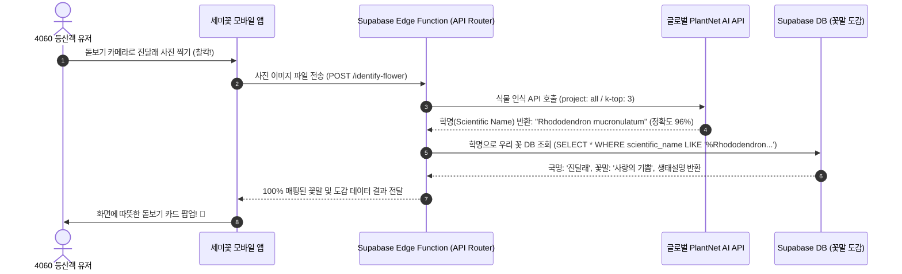

# 🤖 세미꽃 - 공공데이터 입수 방법 및 AI 식별 엔진 파이프라인 가이드

> **"100% 무료 공공데이터 API 입수부터 PlantNet AI 식별 연동까지"**  
> 본 문서(`04_data_acquisition_and_ai_pipeline.md`)는 대한민국 공공데이터포털(data.go.kr)의 야생화 및 꽃말 데이터를 수집하여 Supabase DB에 적재하는 파이썬(Python) 자동화 스크립트와, 유저 촬영 사진을 AI로 분석하여 우리 꽃 DB와 매핑하는 실무 파이프라인을 안내합니다.

---

## 1. 우리나라 공공데이터 확보 방안 (Data Acquisition)

### ① 입수 대상 오픈 API 명세서
| 기관명 | 서비스명 | 주요 활용 데이터 | API 발급처 |
| :--- | :--- | :--- | :--- |
| **농촌진흥청** | **오늘의 꽃 조회 서비스 API** | • **꽃말 (Flower Language)**<br>• 한글 국명 / 학명<br>• 개화 시기 및 기르기/생태 이야기 | [data.go.kr](https://www.data.go.kr) |
| **산림청 국립수목원** | **식물자원 조회 NATURE API** | • 한국 자생 야생화 DB<br>• 특산/희귀 식물 자생지 분포 특성 | [data.go.kr](https://www.data.go.kr) |
| **AI 허브 (AI Hub)** | **식의약용 자생식물 분석 데이터** | • 자생식물 꽃/잎 고화질 사진 수십만 장<br>• 향후 자체 온디바이스 AI 파인튜닝 학습용 | [aihub.or.kr](https://aihub.or.kr) |

---

### ② 공공데이터 수집 및 Supabase DB 적재 파이썬 스크립트 (`seeding_flowers.py`)

아래 스크립트는 농촌진흥청 '오늘의 꽃 API'를 호출하여 꽃말과 학명을 가져온 뒤, Supabase의 `flowers_encyclopedia` 테이블에 자동으로 insert하는 실무 자동화 스크립트입니다:

```python
import os
import requests
import xml.etree.ElementTree as ET
from supabase import create_client, Client

# 1. Supabase 및 공공데이터 API 환경 변수 설정
SUPABASE_URL = "https://your-project-id.supabase.co"
SUPABASE_KEY = "your-service-role-api-key"
PUBLIC_DATA_API_KEY = "your-data-go-kr-decoding-api-key"

supabase: Client = create_client(SUPABASE_URL, SUPABASE_KEY)

def fetch_and_seed_daily_flowers():
    """농촌진흥청 오늘의 꽃 API를 호출하여 도감 DB를 구성합니다."""
    print("🌸 [세미꽃] 공공데이터 꽃말 DB 수집 작업을 시작합니다...")
    
    # 예시: 1월부터 12월까지의 꽃 데이터 순차 조회 (API 파라미터 규격에 맞춤)
    base_url = "http://api.nongsaro.go.kr/service/todayFlower/todayFlowerList"
    
    for month in range(1, 13):
        for day in range(1, 32):
            params = {
                'apiKey': PUBLIC_DATA_API_KEY,
                'fMonth': str(month).zfill(2),
                'fDay': str(day).zfill(2)
            }
            try:
                response = requests.get(base_url, params=params)
                if response.status_code != 200:
                    continue
                
                # XML 파싱
                root = ET.fromstring(response.content)
                items = root.findall('.//item')
                
                for item in items:
                    korean_name = item.find('flowNm').text if item.find('flowNm') is not None else ""
                    scientific_name = item.find('fSciNm').text if item.find('fSciNm') is not None else ""
                    flower_language = item.find('flowLang').text if item.find('flowLang') is not None else ""
                    description = item.find('fContent').text if item.find('fContent') is not None else ""
                    img_url = item.find('imgUrl1').text if item.find('imgUrl1') is not None else ""
                    
                    if not korean_name or not scientific_name:
                        continue
                    
                    # Supabase DB에 적재 (학명 기준 중복 무시)
                    data = {
                        "korean_name": korean_name.strip(),
                        "scientific_name": scientific_name.strip(),
                        "flower_language": flower_language.strip(),
                        "description": description.strip(),
                        "blooming_season": f"{month}월",
                        "rarity_tier": "친근한꽃",
                        "default_image_url": img_url
                    }
                    
                    # DB Insert
                    res = supabase.table("flowers_encyclopedia").upsert(
                        data, on_conflict="scientific_name"
                    ).execute()
                    
                    print(f"✅ DB 저장 완료: {korean_name} ({scientific_name}) - 꽃말: {flower_language}")
            
            except Exception as e:
                print(f"⚠️ 데이터 수집 중 오류 발생 (월:{month}, 일:{day}): {e}")

if __name__ == "__main__":
    fetch_and_seed_daily_flowers()
```

---

## 2. AI 꽃 식별 엔진 매칭 파이프라인 (AI Recognition Pipeline)



---

### ① PlantNet 식물 식별 API 연동 실무 (Node.js / Supabase Edge Function)

초기 MVP 모델에서는 상용 API 중 비용이 저렴하고 아시아권 식물 인식률이 90%가 넘는 **PlantNet API**를 Supabase Edge Function에서 호출합니다:

```javascript
// Supabase Edge Function: supabase/functions/identify-flower/index.ts
import { serve } from "https://deno.land/std@0.168.0/http/server.ts";
import { createClient } from "https://esm.sh/@supabase/supabase-js@2";

const PLANTNET_API_KEY = Deno.env.get("PLANTNET_API_KEY");
const SUPABASE_URL = Deno.env.get("SUPABASE_URL");
const SUPABASE_ANON_KEY = Deno.env.get("SUPABASE_ANON_KEY");

serve(async (req) => {
  try {
    const formData = await req.formData();
    const imageFile = formData.get("image");

    if (!imageFile) {
      return new Response(JSON.stringify({ error: "이미지 파일이 없습니다." }), { status: 400 });
    }

    // 1. PlantNet API 호출 (전 세계 식물 도감 중 상위 3개 매칭 후보 조회)
    const plantNetUrl = `https://my-api.plantnet.org/v2/identify/all?api-key=${PLANTNET_API_KEY}&lang=en`;
    const plantNetForm = new FormData();
    plantNetForm.append("images", imageFile);
    plantNetForm.append("organs", "flower"); // 꽃 부위 위주 식별

    const aiRes = await fetch(plantNetUrl, {
      method: "POST",
      body: plantNetForm,
    });
    const aiData = await aiRes.json();

    if (!aiData.results || aiData.results.length === 0) {
      return new Response(JSON.stringify({ found: false, message: "꽃을 인식하지 못했습니다. 더 가까이 찍어보세요! 🌿" }), { status: 200 });
    }

    // 2. 가장 신뢰도가 높은 1위 후보의 학명(Scientific Name) 추출
    const bestMatch = aiData.results[0];
    const scientificNameRaw = bestMatch.species.scientificNameWithoutAuthor; // 예: "Rhododendron mucronulatum"
    const score = Math.round(bestMatch.score * 100); // 일치율 (%)

    // 3. Supabase DB에서 해당 학명과 일치하는 '한국 야생화 꽃말' 조회
    const supabase = createClient(SUPABASE_URL, SUPABASE_ANON_KEY);
    const { data: flowerData, error } = await supabase
      .from("flowers_encyclopedia")
      .select("*")
      .ilike("scientific_name", `%${scientificNameRaw}%`)
      .limit(1)
      .single();

    if (error || !flowerData) {
      // 국내 도감 DB에 아직 없는 외국 종이나 미등록 꽃인 경우
      return new Response(JSON.stringify({
        found: true,
        is_mapped: false,
        scientific_name: scientificNameRaw,
        ai_score: score,
        fallback_name: bestMatch.species.commonNames[0] || scientificNameRaw,
        message: "AI가 꽃을 인식했지만, 아직 세미꽃 수첩에 등록되지 않은 꽃이에요!"
      }), { status: 200 });
    }

    // 4. 완벽 매핑 성공! 한글 이름과 꽃말 반환
    return new Response(JSON.stringify({
      found: true,
      is_mapped: true,
      ai_score: score,
      flower: {
        id: flowerData.id,
        korean_name: flowerData.korean_name,
        scientific_name: flowerData.scientific_name,
        flower_language: flowerData.flower_language,
        description: flowerData.description,
        blooming_season: flowerData.blooming_season,
        rarity_tier: flowerData.rarity_tier
      }
    }), { status: 200, headers: { "Content-Type": "application/json" } });

  } catch (err) {
    return new Response(JSON.stringify({ error: err.message }), { status: 500 });
  }
});
```

---

## 3. 향후 2단계: AI Hub 자생식물 데이터 기반 파인튜닝 가이드

서비스 출시 후 유저와 갤러리 데이터가 쌓이면, 상용 API 비용(PlantNet)을 절감하기 위해 오픈소스 모델로 자율 전환합니다.

1. **데이터셋 준비**: AI 허브(aihub.or.kr)에서 **[식의약용 자생식물 분석 데이터]** 다운로드 (약 300종, 15만 장 이미지).
2. **모델 선정**: Hugging Face의 `google/vit-base-patch16-224` (Vision Transformer) 또는 `YOLOv8-cls` 경량 분류 모델.
3. **학습 및 변환**: PyTorch로 한국 1,000대 자생 야생화 분류기 학습 진행 ➔ **ONNX / TensorFlow Lite (`.tflite`)** 형식으로 모델 변환.
4. **온디바이스 탑재**: React Native의 `react-native-fast-tflite` 패키지를 통해 스마트폰 앱 내부에서 오프라인 1초 식별 실행!
